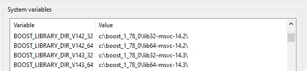

# twain_library_source
Dynarithmic TWAIN library source and development repository.

This repositiory contains the source code and development versions of the Dynarithmic TWAIN Library DLL and PDB files.  

----

**Please note -- Due to licensing issues, the debug versions of the DLL's requires you to rebuild them locally. 

* dtwain32d.dll
* dtwain32ud.dll
* dtwain64d.dll
* dtwain64ud.dll

The only DLL's that are available in this repository without having to build them are the Release versions.
See the steps below to getting setup in building the release and debug versions of the Dynamic Link Libraries.

----

### Rebuilding the Dynarithmic TWAIN Library from source ###

**Please note -- these build steps only supports Visual Studio 2019 and above.**

If you want to rebuild the libraries, you will need the following tools and computer resources:

One of the following compilers:

      * Visual Studio 2019
      * Visual Studio 2022
      
In addition, you will need 

1) At least 20 GB of free disk space.
2) An installation of the [Boost](http://www.boost.org/) library (version 1.70 or above)
3) An installation of the [7-Zip](https://www.7-zip.org/) archiving utility.
4) An installation of the [DirHash](https://idrassi.github.io/DirHash/) utility to compute the hash value of the resulting output files.
5) The following environment variables must be set before compilation (if using the Visual Studio IDE, these variables must be set before starting the IDE):

*    BOOST_INCLUDE_DIR
*    ZIP7_UTIL_CMD
*    DIRHASH_UTIL_CMD

The **BOOST_INCLUDE_DIR** should point to your boost installation folder.  This is usually **C:\boost_install_directory**, where this folder contains a subsequent **Boost** folder, containing the **Boost** header files.  For example:

```plaintext
SET BOOST_INCLUDE_DIR=C:\boost_installation\boost
```
    
Since the DTWAIN build also requires to link to the prebuilt Boost libraries, you must also set the appropriate environment variables to link to the boost library.  The directory will
correspond with the version of the compiler's "Platform Toolset" you will use when building DTWAIN.

The DTWAIN Visual Studio solution and project files are built to support the following Visual Studio Platform Toolsets:

* v140 (Visual Studio 2015)
* v141 (Visual Studio 2017)
* v142 (Visual Studio 2019)
* v143 (Visual Studio 2022)

When you load the solution and project files in the Visual Studio IDE, you may be prompted to upgrade the platform toolset from v140 to the latest version that is supported by the particular Visual Studio compiler you are using.  You can choose to leave the platform toolset as-is, or decide to upgrade to the latest one.  However the platform toolset must be v140, v141, v142, or v143, and your current installation must have this toolset installed for your compiler.

The version of the Boost library that will be used at link time must match the platform toolset that DTWAIN was built with.   This must be set before openeing Visual Studio.

To easily facilitate this, the following environment
variables should be created before starting Visual Studio and building DTWAIN:

*    BOOST_LIBRARY_DIR_V140_32
*    BOOST_LIBRARY_DIR_V140_64    
*    BOOST_LIBRARY_DIR_V141_32
*    BOOST_LIBRARY_DIR_V141_64    
*    BOOST_LIBRARY_DIR_V142_32
*    BOOST_LIBRARY_DIR_V142_64    
*    BOOST_LIBRARY_DIR_V143_32
*    BOOST_LIBRARY_DIR_V143_64    

To set the enviroment variables, you can either do this from the command-line using the **SET** command, or if you are a GUI enthusiast, on Windows you can use the built-in system environment variable tool that allows you to add enviroment variables, available from the Settings menu:



The **BOOST_LIBRARY_DIR_xxxx_32**, where **xxxx** is the platform toolset you are using to build with, is the directory where the 32-bit boost libraries are installed.  These libraries would be named similar to **libboost_xxxxxxxx-vcyyy-zzzz-x32.lib**.  For example, from a command prompt, the following will set the boost environment variable to allow the usage of the 32-bit version of
Boost for the v142 platform toolset:

```plaintext
SET BOOST_LIBRARY_DIR_V142_32=C:\boost_installation\lib32-msvc-14.2
```

The **BOOST_LIBRARY_DIR_xxxx_64**, where **xxxx** is the compiler you are using to build with, is the directory where the 64-bit boost libraries are installed.  These libraries would be named similar to **libboost_xxxxxxxx-vcyyy-zzzz-x64.lib**.  For example:

```plaintext
SET BOOST_LIBRARY_DIR_V142_64=C:\boost_installation\lib64-msvc-14.2
```

If you are using Visual C++, I recommend getting the pre-built boost libraries found at [SourceForge](https://sourceforge.net/projects/boost/files/boost-binaries/).  When installed, you will get the boost **include** files, plus the library files.  Please download the version of boost that fits your compiler.  

```plaintext
For platform toolset v140 -- Download files with "14.0" in the file name.
For platform toolset v141 -- Download files with "14.1" in the file name.
For platform toolset v142 -- Download files with "14.2" in the file name.
For platform toolset v143 -- Download files with "14.3" in the file name.
```


If you are not using Visual C++, you will need to build the following boost libraries:  
* chrono
* date_time
* filesystem
* log
* system
* thread

----
The **ZIP7_UTIL_CMD** is the full path name of the executable file **7z.exe** of the **7-Zip** archiving utility.  For example:

```plaintext
SET ZIP7_UTIL_CMD=C:\7-Zip\7z.exe
```
----
The **DIRHASH_UTIL_CMD** is the full path name of the executable file **DirHash.exe** of the **DirHash** hash value computing utility.  For example:

```plaintext
SET DIRHASH_UTIL_CMD=C:\DirHash\DirHash.exe
```

If the environment variable is not set, the library files will be built, but the hash code computation of the output files will fail to execute.  

The final hashes of the files are stored as text in the **binaries\32bit** and **binaries\64bit** folders (the names of the files will look something like **xxxxxxhash.txt**).

----------
Note that the C++ source code should be able to be built with any C++17 compliant compiler that recognizes the Windows API headers.  However we have not tested builds of the DTWAIN library that have been built with any other compiler other than the Visual Studio family.   

* Start Visual Studio, and open one of the DTWAIN solution.  The DTWAIN solution files are found in the [source](https://github.com/dynarithmic/twain_library_source/tree/master/source) directory.  Open **dtwain_5_vs2019.sln**.

* A full rebuild of all the configurations available is recommended.  Use the "Build -> Batch Build..." option in the Visual Studio IDE and check all of the configurations to build everything (take a coffee break -- this could take a while).  This will create a "binaries" directory that will contain the following DLLs:

        32bit/dtwain32.dll -32-bit ANSI (MBCS) DLL
        32bit/dtwain32u.dll -32-bit Unicode DLL
        32bit/dtwain32d.dll -32-bit Debug ANSI (MBCS) DLL
        32bit/dtwain32ud.dll -32-bit Debug Unicode DLL
        64bit/dtwain64.dll -64-bit ANSI (MBCS) DLL
        64bit/dtwain64u.dll -64-bit Unicode DLL
        64bit/dtwain64d.dll -64-bit Debug ANSI (MBCS) DLL
        64bit/dtwain64ud.dll -64-bit Debug Unicode DLL

* Note -- the resulting "*.lib* files that reside in these directories are import libraries compatible with the Visual Studio toolset.  Other compilers will require converting these .lib files to your compiler's import library format, or you can use the LoadLibrary / GetProcAddress approach (we have a wrapper for this -- see below in the "Getting DTWAIN to work with other programming languages" section).

* If the IMPLIB.EXE program from Embarcadero is available on the path, it will be called to create Embarcadero C++ compatible import libraries for the 32-bit DLL's.  The names of the Embarcadero import libraries will have a **_embarcadero** appended to the library name.

* When all the configurations are built, there should be multiple DTWDEMO*.exe programs residing in the **binaries** subdirectory, where the suffix used in the program name matches the DTWAIN DLL that will be loaded.  For example, DTWDEMO32U.exe will load the dtwain32u.dll library when run. The easiest way to get started is to debug DTWDEMO.EXE and single step through the program using the debugger to get a feel of the flow of the program.  You should get a good idea of how DTWAIN works if you step into one or more of the DTWAIN functions (such as DTWAIN_SysInitialize or DTWAIN_SelectSource).

----
### Building the demo applications
If you wish to build the demo applications, the **demos\AllDemos.sln** file can be loaded into Visual Studio 2019 or 2022.  Please note that you must build the base libraries first (by building using the **dtwain_5_vs2019.sln** project, mentioned above) before building the demos.  

The demos consist of C and C++ language demos, plus C++ demos based on an experimental C++ wrapper library that is currently being developed.  In addition, there are C# and Visual Basic *.sln files you can load, build, and test the functionality of DTWAIN.

----

### Contributing your updates to this repository
If you wish to add your own changes to this repository, it is highly suggested that you "git clone" the **development** branch, and then make a pull request to have your changes merged into the development branch (not the **main** branch).  Once the pull request passes review, the updated changes will be merged into the development branch.  

When deemed appropriate by the maintainer of this repository, the development branch will be merged into the main branch.  Then the main branch will be used to build the libraries found in the dynarithmic/twain_library repository.  The main branch will always reflect the current build being distributed to the public in the dynarithmic/twain_library repository. 

