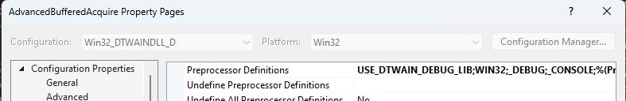

# Dynarithmic TWAIN Library Source Code

This repository contains the source code and development versions of the Dynarithmic TWAIN Library DLL (DTWAIN).  

The DTWAIN library is written in C++ (using language standard C++ 17) with a few modules written in C (mostly the third-party imaging libraries are written in C).

----
# Table of Contents
1. [Obtaining the latest development binaries](#obtain-dev-libraries)
2. [Building DTWAIN from source](#rebuild-source)
    * [Requirements](#rebuild-requirements)
    * [Disk space requirements](#rebuild-disk-space)
    * [Visual Studio requirements](#rebuild-vs-requirements)
    * [Build Configurations](#build-configurations)
    * [Build Using Batch Files](#build-using-batchfiles)
        * [Boost Library Configuration](#boost-library-configuration)
            * [Automatic Boost Download](#download-boost)
            * [Use Existing Boost Installation](#use-existing-boost)
    * [Advanced Usage — CMake Command Line](#advanced-cmake)
    * [Using CMake-GUI](#cmake-gui)
    * [Notes for existing users](#notes-existing-users)
3. [Building the Demo Programs](#build-demo)  
4. [Contributing updates](#contribute-updates)
5. [Source Code Analysis Tools used](#tools-we-use)

----

## <a name="obtain-dev-libraries"></a> Obtaining the latest development binaries ###

To obtain the latest development binaries (DLL's, PDB files, import libraries, etc.):<br>
For 32-bit: 
[DTWAIN-Binaries-x86.zip](https://github.com/dynarithmic/twain_library_source/releases/download/development-latest/DTWAIN-Binaries-x86.zip)


For 64-bit:
[DTWAIN-Binaries-x64.zip](https://github.com/dynarithmic/twain_library_source/releases/download/development-latest/DTWAIN-Binaries-x64.zip)

The development binaries are built from the latest source code found in the [development branch](https://github.com/dynarithmic/twain_library_source/tree/development).  

1) To run DTWAIN using the development libraries will also require you to use the [text resources](https://github.com/dynarithmic/twain_library_source/tree/development/source/txt) found in the development branch, and not the text resources found in the main branch.  

2) The code found in the [main branch](https://github.com/dynarithmic/twain_library_source/tree/main) reflects the current release version of DTWAIN.<br> If you want to debug the current release version of DTWAIN, the code in the main branch is the code you should retrieve.  

3) Please note that whenever new code is pushed to the development branch, new development binaries will also be created.  

----

## <a name="rebuild-source"></a> Building the Dynarithmic TWAIN Library from Source

Beginning with **DTWAIN 5.9.1**, rebuilding DTWAIN from source has transitioned from pre-generated Visual Studio solution files to a **CMake-based build system**.

Previous DTWAIN versions distributed Visual Studio project and solution files directly. These have been replaced with generated solutions created using CMake.

This change allows:

* Support for multiple Visual Studio versions from a single build system
* Automated [Boost C++ library](http://www.boost.org) setup (optional)
* Separate build directories for 32-bit and 64-bit builds
* Easier customization of Unicode / ANSI builds
* Configurable runtime (CRT / No CRT)
* Cleaner long-term maintenance of the build system

Users who only consume the prebuilt DTWAIN binaries are unaffected.

---

## <a name="rebuild-requirements"></a> Requirements

Before rebuilding DTWAIN from source:

#### Required

* Visual Studio 2019 or later (see below for the exact Visual Studio requirements)
* [CMake 3.25 or later (including CMake 4.x)](https://cmake.org/download/)
#### Optional

* Existing Boost library installation (version 1.89 or greater)

or

* Enable automatic Boost library download during configuration

#### <a name="rebuild-disk-space"></a>Disk Space Requirements

Building DTWAIN from source requires additional disk space for generated build files, intermediate objects, debug symbols, and optional Boost installation.

Recommended minimum free space:

- ~10 GB free for building a single compiler / architecture configuration with automatic Boost installation enabled
- Additional space may be required when building multiple configurations simultaneously

Examples of increased usage:

- Building Debug and MinSizeRel
- Installing Boost automatically
- Building both x86 and x64 variants
- Building multiple Visual Studio versions

----

#### <a name="rebuild-vs-requirements"></a>Visual Studio Requirements

Building DTWAIN from source requires a Visual Studio installation with C/C++ development tools.

#### Installing Visual Studio

If Visual Studio is not already installed:

Visual Studio Community (free):
https://visualstudio.microsoft.com/vs/community/

Install Visual Studio 2019 or later.

During installation, ensure that the following workload is selected:

Required workload:
- Desktop development with C++

Required components:
- MSVC C++ compiler
- MSVC v142 (Visual Studio 2019) or MSVC v143 (Visual Studio 2022)
- Windows 10 SDK or Windows 11 SDK
- C++ CMake tools for Windows

The default Visual Studio installation may not include C/C++ support.  Thus you must ensure that the C/C++ support defined above has been selected during installation of Visual Studio.

Optional:

- Git for Windows
- C++ AddressSanitizer (developer use)

If CMake configuration reports that no suitable compiler is found, re-run the Visual Studio Installer and add the C++ workload.

----

#### Visual Studio 2026

Visual Studio 2026 support is experimental.

DTWAIN is officially built and tested with Visual Studio 2019 and Visual Studio 2022.

Developers who want to experiment with Visual Studio 2026 may use the Visual Studio 2022 CMake presets as a starting point, generate the Visual Studio solution files, and then open the generated solution in Visual Studio 2026.

Boost library compatibility may require either:

- [using an existing Boost installation](#use-existing-boost) known to work with the VS2026 compiler, or
- [overriding the Boost MSVC binary tag manually](#advanced-cmake)

At this time, Visual Studio 2026 is not part of the official DTWAIN release build matrix.

---

#### <a name="build-configurations"></a>Build Configurations

DTWAIN supports the following release build variants:

| Architecture | Character Set | Runtime |
| ------------ | ------------- | ------- |
| x86          | ANSI          | CRT     |
| x86          | ANSI          | No CRT  |
| x86          | Unicode       | CRT     |
| x86          | Unicode       | No CRT  |
| x64          | ANSI          | CRT     |
| x64          | ANSI          | No CRT  |
| x64          | Unicode       | CRT     |
| x64          | Unicode       | No CRT  |

Debug builds are generated separately and are intended primarily for developers debugging DTWAIN internals.

---

### <a name="build-using-batchfiles"></a>Build Using Batch Files (Recommended)

The repository contains batch files which act as wrappers around CMake presets.

By default, running the batch file will create two directories, **MinSizeRel** and **Debug**, within the output folder of the build (the name of the output folder will match the name of the batch file that was used to compile the source code.)  

After a successful build, the **MinSizeRel** directory will contain the release, non-debug versions of the DLL's, PDB files and import libraries that have been built.  The **Debug** directory will contain the debug version of the DLL's, PDB files and import libraries.

----

Each batch file configures and builds a specific DTWAIN configuration (Visual Studio version, architecture, Unicode/ANSI, CRT/No CRT).

Examples:

```text
build_vs2019_x64_crt_unicode.bat
build_vs2022_x32_nocrt_ansi.bat
````

Running a batch file performs the following steps:

1. Configure CMake using a preset
2. Generate Visual Studio solution files
3. Locate or install Boost (if enabled)
4. Build DTWAIN
5. Build DTWDEMO

Example:

```bat
build_vs2022_x64_crt_unicode.bat
```

Generated output appears under the build directory associated with the selected preset.

Example:

```text
build-vs2022-x64-crt_unicode\
```

Successful builds generate:

```text
MinSizeRel\
Debug\
```

containing DLLs, import libraries, PDB files, and demo programs.

----

### <a name="boost-library-configuration"></a> Boost Library Configuration
When building the source code, you have an option of automatically downloading the Boost Library components, or use an existing Boost library installation.

The default tested Boost version used by the CMake presets is `1.91.0`. 

Advanced users may change `DTWAIN_BOOST_VERSION` in `CMakePresets.json`, provided the matching Boost binary package exists for their Visual Studio compiler.  For example:

`"DTWAIN_BOOST_VERSION" : "1.90.0"`

Please note that the minimum version of Boost that can be used to build DTWAIN is **1.89.0**.  Using a version earlier than 1.89.0 will result in compilation errors.

----
#### <a name="download-boost"></a> Automatic Boost Download

To automatically download and install Boost:

Edit the appropriate preset in:

```text
CMakePresets.json
````

Example:

```json
"DTWAIN_AUTO_DOWNLOAD_BOOST": "ON",
"DTWAIN_BOOST_CACHE_ROOT": "C:/BoostDeps"
```

If Boost is not already installed, DTWAIN will:

* Download Boost binaries
* Install Boost locally
* Configure include and library paths automatically

The Boost installation directory should be a relatively short path due to long internal Boost directory names.

Example locations:

```text
C:/BoostDeps
D:/BoostDeps
E:/Libraries/BoostDeps
```

Installed Boost binaries may be reused by future builds.

----
#### <a name="use-existing-boost"></a> Using an Existing Boost Installation

DTWAIN requires Boost 1.89.0 or later.

Build options are controlled through:

```text
CMakePresets.json
````

To use an existing Boost installation:

Edit the appropriate preset and set:

```json
"DTWAIN_EXISTING_BOOST_ROOT": "D:/boost_1_90_0",
"DTWAIN_AUTO_DOWNLOAD_BOOST": "OFF"
```

The existing Boost installation must follow the directory layout expected by DTWAIN.

Example:

```text
boost_1_xx_x/
    boost/
    lib32-msvc-14.x/
    lib64-msvc-14.x/
```

At minimum, the installation must contain the library directory corresponding to the architecture(s) being built.

----
----

#### <a name="advanced-cmake"></a> Advanced Usage — CMake Command Line
Advanced users may invoke CMake directly without using the batch files.

List available presets:

```bat
cmake --list-presets
````

Configure:

```bat
cmake --preset vs2022-x64-crt-unicode
```

Build:

```bat
cmake --build --preset vs2022-x64-crt-unicode-release
cmake --build --preset vs2022-x64-crt-unicode-debug
```

Users familiar with CMake may also edit `CMakePresets.json` directly to customize build behavior.

----

#### <a name="cmake-gui"></a> Using CMake-GUI
Users who prefer a graphical interface may use CMake-GUI instead of the command line.

1. Start CMake-GUI
2. Set:
   * Source directory ? DTWAIN source root
   * Build directory ? desired output directory
3. Click **Configure**
4. Select the desired Visual Studio generator
5. Optionally choose a preset from `CMakePresets.json`
6. Modify cache values if desired
7. Click **Generate**
8. Open the generated Visual Studio solution

Users familiar with CMake-GUI may override values from `CMakePresets.json` before generating.

Typical values that may be customized:

```text
DTWAIN_BUILD_UNICODE
DTWAIN_USE_DYNAMIC_CRT
DTWAIN_ENABLE_LOGCALLSTACK
DTWAIN_AUTO_DOWNLOAD_BOOST
DTWAIN_BOOST_CACHE_ROOT
DTWAIN_EXISTING_BOOST_ROOT
````
----
----
#### <a name="notes-existing-users"></a> Notes for Existing Users

Previous DTWAIN versions distributed pre-generated Visual Studio solution files.

DTWAIN now uses generated Visual Studio solutions via CMake.

Old workflow:

```text
Open .sln
Build
````

New workflow:

```text
Run batch file
(or configure via CMake / CMake-GUI)

Open generated .sln
Build
```

Generated solutions retain normal Visual Studio functionality including debugging, natvis visualizers, and standard project navigation.

----
----
## <a name="build-demo"></a> Building the demo applications
The demo programs have not been migrated to CMake projects.  Instead they will remain as Visual Studio solutions that need to be loaded explicitly into Visual Studio.

##### C++

If you wish to build the C and C++ demo applications, the **demos\AllDemos.sln** file can be loaded into Visual Studio 2019 or 2022.  Please note that you must build the base libraries first.  The demos consist of C and C++ language demos, plus C++ demos based on an experimental C++ wrapper library that is currently being developed.

###### C#

The C# demo is **demos\csharp\Examples\FullDemo\CSharp_FullDemo.csproj**
This project is by default, setup for 32-bit Unicode (the dtwain32u.cs is part of the projects).  If you want to try 64-bit builds, please replace the dtwain32u.cs with one of the 64-bit .cs files (for example dtwain64u.cs).

###### Visual Basic

The Visual Basic demo is **demos\VisualBasic\Examples\FullDemo\VB_FullDemo.vbproj**
This project is by default, setup for 32-bit Unicode (the dtwain32u.vb is part of the projects).  If you want to try a 64-bit builds, please replace the dtwain32u.vb with one of the 64-bit .cs files (for example dtwain64u.vb).

-----
##### Using the debug DTWAIN DLL's in the C/C++ demo programs
The demo programs, by default, will use the release versions of the DTWAIN DLL's.  To use the debug versions of the DTWAIN library, one of the two options is available:

1) Use the following `#define` at the beginning of the main source file that include's **dtwain.h**:
```cpp
#define USE_DTWAIN_DEBUG_LIB
```
or

2) Define `USE_DTWAIN_DEBUG_LIB` as a **-D** or **/D** preprocessor setting on the compiler-command line (example would be **/DUSE_DTWAIN_DEBUG_LIB** on the compiler's command-line).



If the debug libraries are being used, during the compilation phase in Visual Studio, you should receive the following message in the compiler Output Window:

```plaintext
Using import library xxxxxx.lib in link phase..
```
where "xxxxxx.lib" will be one of the following:

```plaintext
dtwain32d.lib    (this will use dtwain32d.dll at runtime)
dtwain32ud.lib   (this will use dtwain32ud.dll at runtime)
dtwain64d.lib    (this will use dtwain64d.dll at runtime)
dtwain64ud.lib   (this will use dtwain64ud.dll at runtime)
```

-----
##### Using the debug DTWAIN DLL's in a C# or Visual Basic program
The demo programs, by default, will use the release versions of the DTWAIN DLL's.  To use the debug versions of the DTWAIN library, build your application with one of the following interface files:

C#:
```plaintext
dtwain32d.cs     (this will use dtwain32d.dll at runtime)
dtwain32ud.cs    (this will use dtwain32ud.dll at runtime)
dtwain64d.cs     (this will use dtwain64d.dll at runtime)
dtwain64ud.cs    (this will use dtwain64ud.dll at runtime)
```


Visual Basic:
```plaintext
dtwain32d.vb     (this will use dtwain32d.dll at runtime)
dtwain32ud.vb    (this will use dtwain32ud.dll at runtime)
dtwain64d.vb     (this will use dtwain64d.dll at runtime)
dtwain64ud.vb    (this will use dtwain64ud.dll at runtime)
```
----
----

## <a name="contribute-updates"></a> Contributing your updates to this repository
If you wish to add your own changes to this repository, it is highly suggested that you "git clone" the **development** branch, and then make a pull request to have your changes merged into the development branch (not the **main** branch).  Once the pull request passes review, the updated changes will be merged into the development branch.  

When deemed appropriate by the maintainer of this repository, the development branch will be merged into the main branch.  Then the main branch will be used to build the libraries found in the dynarithmic/twain_library repository.  The main branch will always reflect the current build being distributed to the public in the dynarithmic/twain_library repository. 

----
----
## <a name="tools-we-use"></a> Source Code Analysis Tools used
We use the following tools for source code analysis of the underlying C++ code base for DTWAIN:

[PVS-Studio](https://pvs-studio.com/pvs-studio/?utm_source=website&utm_medium=github&utm_campaign=open_source) - static analyzer for C, C++, C#, and Java code.


