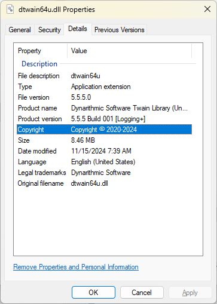

# Dynarithmic TWAIN library binaries

This directory consists of four sub-directories, **full_logging**, **full_logging_require_vcruntime**, **partial_logging**, and **partial_logging_require_vcruntime**. 

The **full_logging** and **full_logging_require_vcruntime** directories contains the DLL's that are built with full logging capabilities when the API function **DTWAIN_SetTwainLog** is invoked.  Full logging consists of logging the call stack and return values when calling DTWAIN functions, plus the lower level calls that DTWAIN makes to the TWAIN Data Source Manager.  This is valuable in detecting issues that may occur when issuing calls to DTWAIN.  

The **full_logging_require_vcruntime** directory contains DLL's that require the system to already have installed the [Visual C++ Redistributable Package](https://learn.microsoft.com/en-us/cpp/windows/latest-supported-vc-redist?view=msvc-170).  Since many systems already have this package installed (usually by other programs needing to install this package), the DLL's in this directory can be used (they are smaller in size than the ones in the **full_logging** folder).

----
The **partial_logging** and **partial_logging_require_vcruntime** directories contains the DLL's that are built without call stack and return values being logged.  These DLL's are around 500K to 1MB smaller in size than the DLL's in **full_logging** and **full_logging_require_vcruntime**.  Direct calls to the lower level TWAIN DSM are included, but the call stack and return value logging is not available.

As with **full_logging_require_vcruntime**, the **partial_logging_require_runtime** requires an installation of the Visual C++ Redistributables to already be installed on the target system.

If you are not concerned with sizes of the DLL's, the **full_logging** and **full_logging_require_vcruntime** DLL's should be used.  If you desire DLL's that are a bit smaller and can "sacrifice" call stack / return value logging, the **partial_logging** and **partial_logging_require_vcruntime** DLL's should be used.

----

### How to distinguish between full and partial logging DLLs
Since the names of the DLL's are the same, there are a few ways to distinguish which one is being used:

1) Inspecting the properties of the DLL will show **[Logging+]** in the **Product version** section if the DLL has full logging enabled.  For DLL's that require that the Visual Studio Redistributables to be installed, an addition **[VC++]** appears in the **Product version** section.

You can use Window's File Explorer or other utility to inspect the properties of a DLL file.

Example (Highlight the DLL file in File Explorer, then Alt + Enter, then go to the "Details" tab):

2) Calling **DTWAIN_SetTwainLog** will show **[Logging+]** and/or **[VC++]** in the header information when the log is started.

3) Calling **DTWAIN_GetVersionString** will show **[Logging+]** and/or **[VC++]** in the returned string.
